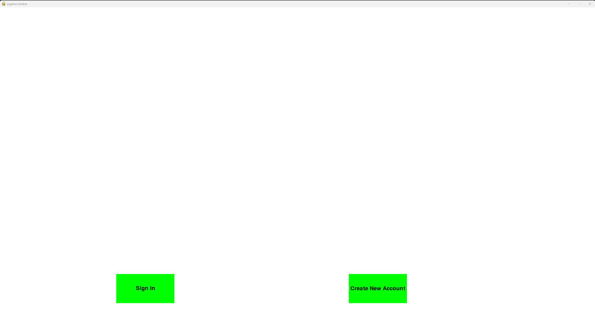

# Final Project: Pygame

## Project Description
---
This project provides entertainment through a more advanced interface using pygame. This program will keep your passwords safe and secure. This progam also keeps track of leaderboards and will show you them in the program.  

## Installation
---
1. Install the extension 'python', click the first item and install it
2. Install the extension 'jupyter', click the first item and install it
3. Install the extension 'coderunner', click the first item and install it    
4. Go to terminal and type 'pip install pygame' then click enter

## Execution
---

+ click the play button in the top right corner
+ sign in to start
+ once signed in (or created account), you can play games
+ press the exit button in the main page to exit

   

## Used Technologies
---
+ pygame
+ csv
+ bcrypt

## Current Features
---
+ This project is able to sustain entertainment for infinite time
+ This project is able to be out of the terminal into a pygame window which adds cool looks
+ Very nice looking buttons and they also work! (definitely a side benefit)
+ Encrypted passwords for secure data!!!   

## Contributing
---

## Contributors
---
+ Samuel --> made the encrypting, sign in function, and cpm game
+ Gabe --> made the pong game
+ Max --> made the tic tac toe game and the main function
+ Aaron --> made platformer game
+ Aaron's Dad's Friend --> jumping and landing on boxes in the platformer game
+ Git Copilot --> helped Gabe learn pygame and base setup features on
+ ChatGPT --> helped Samuel debug code
+ Google Gemini --> helped with the pycache errors in github merging   

## Author's Info
---
Samuel --> My name is Samuel Andelin, I am in a programming class where I get to code stuff, which is pretty fun. I like to play videogames and like to code as well. I mostly code in Python, but I have coded in some Rust. I definitely prefer python because it is a lot less hassle to be secure, but that is probably more important than it being easy.

Max --> 
Aaron -->
Gabe --> My name is Gabriel Crozier, I am currently doing a computer science class. I love video games, Minecraft and Roblox being one of the top things I play. I code only in python for now.

## Change log
---
   
## License
---
   